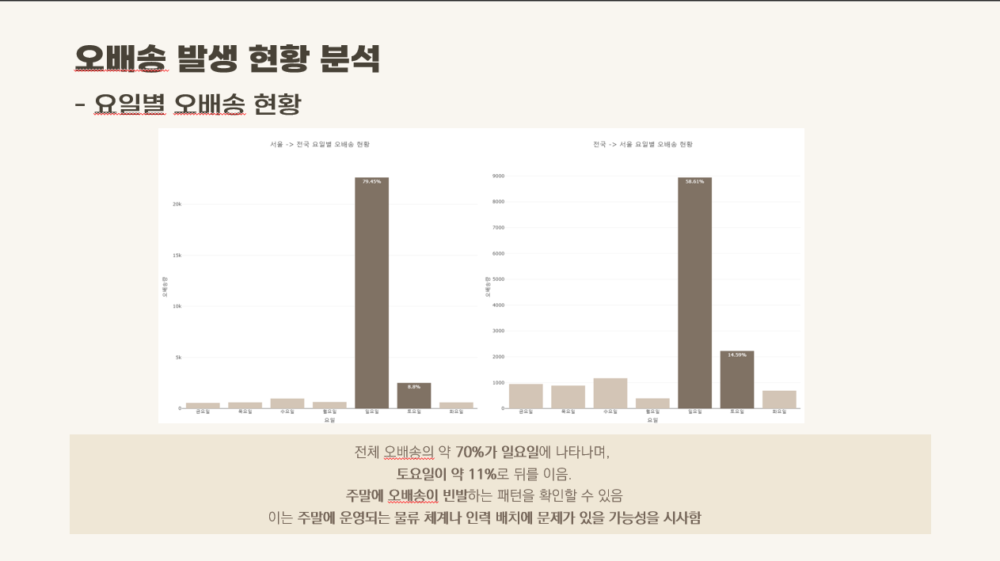
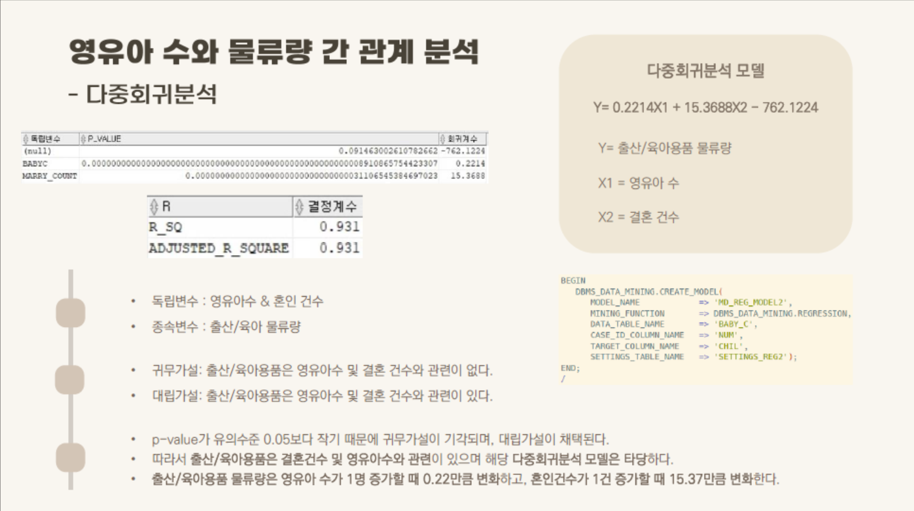
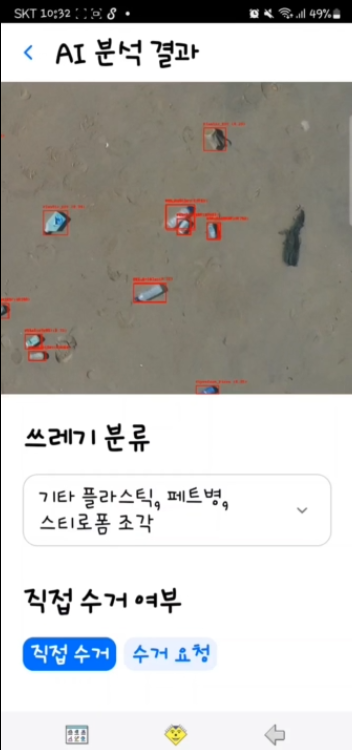

| **Project 1** |  [택배 물류량과 사회적 요인 간의 관계 분석](#택배_포폴250102.pdf) |
|:-------------------------:|:---------------------------------------------------------|
| 메인이미지 |   |
| **주요기술**| Oracle SQL, SQL Regression Model, R, Tableau  |                  |
| **내용**| - 출산 및 육아용품 물류량과 출산 관련 지표 간 상관분석, 회귀분석  - 명절 물류 수요의 연간 추이 분석  - 오배송 발생 현황 분석을 통한 오배송량 감소 방안 모색 |
| **담당업무**| - 데이터 전처리 - Index 및 제약, 비정규화 컬럼 추가 - 데이터 탐색, 시각화, 분석 - 발표자료(PPT) 제작 |

| **Project 1**  [택배 물류량과 사회적 요인 간의 관계 분석](#택배_포폴250102.pdf)        |
|:-----------------------------------------------------------------|
|  |  | 
| **주요기술**  Oracle SQL, SQL Regression Model, R, Tableau                                  |
| **내용**  -	출산 및 육아용품 물류량과 출산 관련 지표 간 상관분석, 회귀분석  -	명절 물류 수요의 연간 추이 분석  -	오배송 발생 현황 분석을 통한 오배송량 감소 방안 모색                                                       |
| **담당업무**  -	데이터 전처리 -	Index 및 제약, 비정규화 컬럼 추가 -	데이터 탐색, 시각화, 분석 -	발표자료(PPT) 제작 |

|   |  |
|:----------------------------------------------------------------:|:----------------------------------------------------------------:|
| **Project 2**  기후변환 데이터 분석                          | **Project 4**  Short description for project 4               |

|   |  |
|:----------------------------------------------------------------:|:----------------------------------------------------------------:|
| **Project 3**  기후변환 데이터 분석                          | **Project 4**  Short description for project 4               |

https://www.canva.com/design/DAGWhpQbPbA/ClM7v-Ti0NCzVQkbfH_3pA/view?utm_content=DAGWhpQbPbA&utm_campaign=designshare&utm_medium=link2&utm_source=uniquelinks&utlId=h106385096f

## Additional Resources

[

Click the thumbnail above to watch the video on YouTube: **"Title of the Video"**.

---

## Certifications

    

