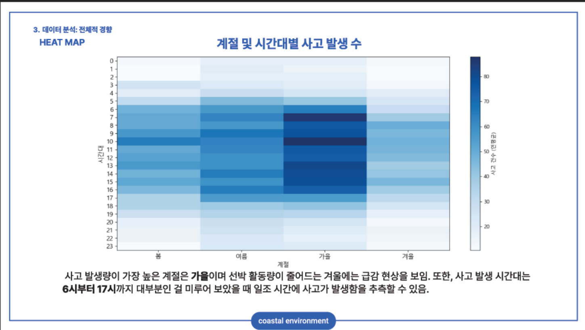
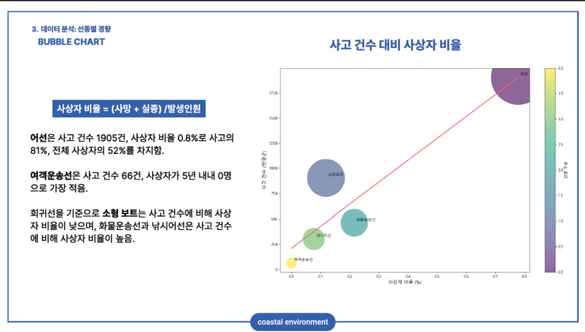
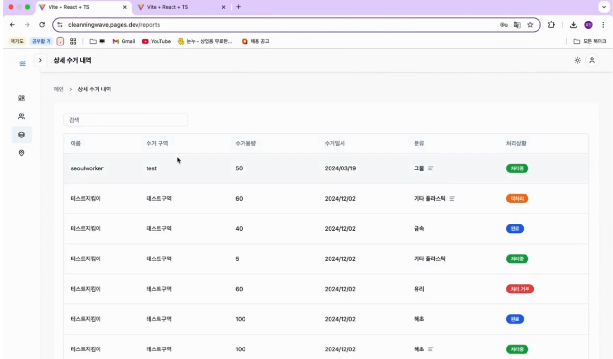

| **Project 1** |  [택배 물류량과 사회적 요인 간의 관계 분석](택배_포폴250102.pdf) |
|:-------------------------:|:---------------------------------------------------------|
| 대표이미지 |   |
| **주요기술**| Oracle SQL, SQL Regression Model, R  |
| **개발기간 및 인원**| 24.05.16 ~ 24.06.20 (1개월) / 2명  |
| **내용**| - 출산 및 육아용품 물류량과 출산 관련 지표 간 상관분석, 회귀분석  - 명절 물류 수요의 연간 추이 분석  - 오배송 발생 현황 분석을 통한 오배송량 감소 방안 모색 |
| **담당업무**| - 데이터 전처리 - Index 및 제약, 비정규화 컬럼 추가 - 데이터 탐색, 시각화, 분석 - 발표자료(PPT) 제작 |

| **Project 2** |  [선박 사고 분석을 통한 해양 안전 관리 체계 개선 방안](연안_포트폴리오_250104.pdf) |
|:-------------------------:|:---------------------------------------------------------|
| 대표이미지 |   |
| **주요기술**| Linux CentOS, MariaDB, Python (Matplotlib, Seaborn, Folium)  |
| **개발기간 및 인원**| 24.09.11 ~ 24.10.24 (1개월) / 3명 |
| **내용**| -	정책적 개입을 하기에 적합한 선박 유형과 지역을 중심으로 주요 위험 요인을 식별 -	데이터 분석 및 시각화를 통해 선박 사고에서 인명 구조와 재산 손실 감소를 목표로 한 정책 개선 방안 제안 |
| **담당업무**| -	Linux CentOS과 MariaDB를 기반으로 별도의 다운로드 없이 테이블을 실시간으로 조회할 수 있도록 DBMS 설계 및 구축 -	오픈 API를 활용한 대규모 데이터 수집 -	데이터 정제 및 전처리를 통해 분석 가능한 형태로 가공 -	시공간 데이터를 기반으로 한 데이터 조인 및 통합 작업 수행 -	결측치 처리 및 비정규화 컬럼 추가를 진행하여 데이터 품질 개선 -	데이터 시각화를 중심으로 한 탐색 및 분석을 통해 주요 인사이트 도출 -	분석 결과와 자료조사를 기반으로 정책적 제안 도출 -	발표 자료(PPT) 제작 및 발표 |

| **Project 3** |  [클리닝웨이브: AI를 통해 해양쓰레기의 보고 및 모니터링 환경을 제공하는 앱과 웹 기반 통합 서비스](https://www.canva.com/design/DAGWhpQbPbA/ClM7v-Ti0NCzVQkbfH_3pA/view?utm_content=DAGWhpQbPbA&utm_campaign=designshare&utm_medium=link2&utm_source=uniquelinks&utlId=h106385096f) |
|:-------------------------:|:---------------------------------------------------------|
| 대표이미지 |   |
| **주요기술**| Linux CentOS, Docker, Python(PyTorch, Swin Transformer, Mask R-CNN)  |
| **개발기간 및 인원**| 24.09.10 ~ 24.12.03 (3개월) / 4명 |
| **내용**| -	머신러닝 기반 앱 개발을 통해 해양쓰레기 수거 공공근로자인 바다환경지킴이의 업무 보고를 간편화 -	웹 백오피스를 통해 담당 공무원의 바다환경지킴이 관리 및 수거 내역 데이터를 분석할 수 있는 시스템 구축 |
| **담당업무**| **1. 머신러닝 모델 개발** -	AI Hub 모델을 활용한 전이 학습 수행 및 성능 지표 평가 -	클래스 추가를 위한 데이터셋 구축: 웹 크롤링을 통해 수집한 데이터에 바운딩박스 처리 적용 -	AI 모델 개발 모식도 작성  **2. 서버 시스템 구축 및 테스트** -	Linux CentOS 환경에서 Docker를 활용한 서버 환경 구축  **3. 서비스 기획 및 관리** -	서비스 기획 및 전문가 인터뷰를 기반으로 기능 요구사항 도출 -	개발 팀과 협력하여 서비스 플로우 차트 및 시퀀스 다이어그램 작성 -	프로젝트 스케줄 관리 및 업무 분배 -	발표자료(PPT) 제작 및 발표 |

## Certifications

    

